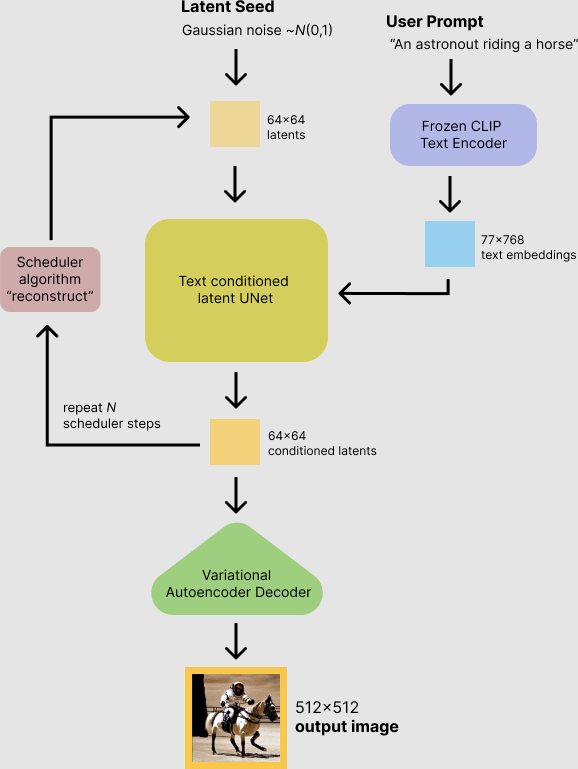

## Inference Stable Diffusion model
## Hardware
For inference was used server with following parameters:
* CPU: 2 x Intel® Xeon® Gold 6248R
* RAM: 376 GB

## Models

| Model name        | Implementation   | Model card                                                                  |
|-------------------|------------------|-----------------------------------------------------------------------------|
| Stable Diffusion  | PyTorch          | [stable-diffusion](https://huggingface.co/CompVis/stable-diffusion-v1-4)    |

Workflow for Stable Diffusion during inference:


## Prerequisites

Before running inference, create python environment:
```
  python3 -m venv <env_name>
  source <env_name>/bin/activate
```

And install the necessary dependencies:
```
  python3 -m pip install -r requirements.txt
```

## Experiments

To run demo please use next command line:

```
python3 txt2img.py -l <launcher_name> \
                   -p <prompt_input>
```

Use `pytorch`, `onnx`, `openvino_onnx` and `openvino` as launcher.

Results of performance experiments:

| Model name        | Number of parameters   | Size of model | PyTorch time  | ONNXRuntime time | OpenVINO time |
|-------------------|------------------------|---------------|---------------|------------------|---------------|
| Stable Diffusion  | 1B                     | 4G            | 125 sec       | 110 sec          | 60 sec        |

All performance measurements have been computed using `DPMSolverMultistepScheduler scheduler 50 steps`
